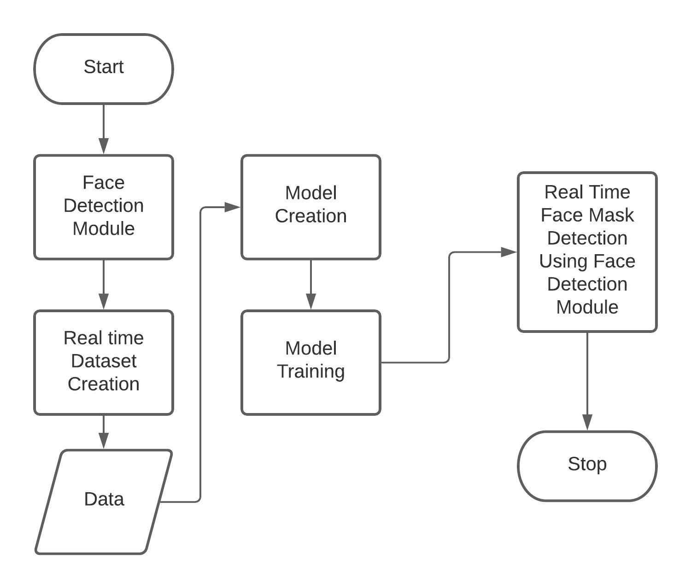

# Face Mask Detection
The aim of the project is to build a Deployment ready application to detect Facemask in a video stream. To reduce the complexity the project is built on Google's [Mediapipe](https://google.github.io/mediapipe/) library. On top of it the frams are processed over a Deeplearning model.

## Libraries

 1. [Mediapipe](https://google.github.io/mediapipe/)
 2. [Tensorflow](https://www.tensorflow.org/)
 3. [OpenCV](https://opencv.org/)

## Installation

 1. Mediapipe
	  `pip install mediapipe`
2. Tensorflow
	`pip install tensorflow`
3. OpenCV
	`pip install opencv-python`

## Working of the Project
	

 - [ ] Flow Chart 
 
	 
 
 - [ ] Model Archicture
	
	 
		
 

## Download Trained Model and Dataset

- [Click Here to download weights and Dataset](https://tinyurl.com/downloadweights)
